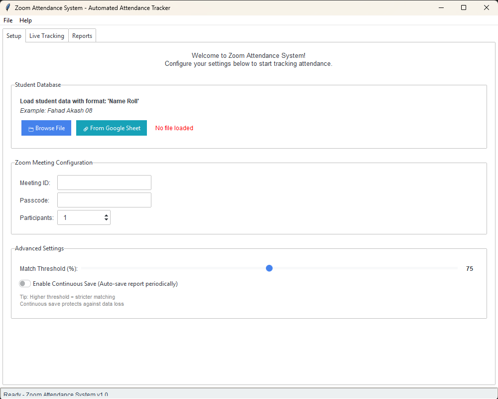

# Zoom Attendance System

An automated attendance tracking system for Zoom meetings that extracts participant information and matches it with student roll numbers.



## Table of Contents
- [Zoom Attendance System](#zoom-attendance-system)
  - [Table of Contents](#table-of-contents)
  - [Overview](#overview)
  - [Features](#features)
  - [How It Works](#how-it-works)
  - [Installation](#installation)
    - [Option 1: Running from Source Code](#option-1-running-from-source-code)
    - [Option 2: Using Pre-built Executable](#option-2-using-pre-built-executable)
  - [Usage](#usage)
    - [Loading Student Data](#loading-student-data)
      - [From Text File](#from-text-file)
      - [From Google Sheets](#from-google-sheets)
    - [Running Meetings](#running-meetings)
    - [Viewing Results](#viewing-results)
    - [Exporting Data](#exporting-data)
      - [To Clipboard](#to-clipboard)
      - [To Excel/CSV](#to-excelcsv)
  - [Building Executable](#building-executable)
  - [Requirements](#requirements)
    - [Python Packages](#python-packages)
  - [License](#license)
  - [Made by](#made-by)

## Overview

The Zoom Attendance System is a Python application that automates the process of tracking attendance in Zoom meetings. It uses Selenium WebDriver to join Zoom meetings programmatically, extract participant names, and match them with student roll numbers from a database.

## Features

- **Automated Zoom Meeting Joining**: Joins Zoom meetings with multiple participants automatically
- **Participant Detection**: Extracts participant names directly from the Zoom web interface
- **Roll Number Matching**: Matches detected names with student roll numbers using fuzzy string matching
- **Google Sheets Integration**: Load student data directly from Google Sheets
- **Real-time Tracking**: Continuously monitors and updates participant lists
- **Multiple Export Formats**: Export attendance data to Excel, CSV, or clipboard
- **Continuous Saving**: Automatically saves attendance reports to prevent data loss
- **Standalone Executable**: Can be built into a single .exe file for easy distribution

## How It Works

1. **Data Loading**: Load student names and roll numbers from a text file or Google Sheet
2. **Meeting Setup**: Enter Zoom meeting ID, passcode, and number of participants
3. **Automated Joining**: The system creates multiple browser instances to join the meeting
4. **Participant Extraction**: Extracts participant names from the Zoom interface
5. **Name Matching**: Matches detected names with student roll numbers using fuzzy matching
6. **Real-time Updates**: Continuously updates the participant list during the meeting
7. **Data Export**: Export attendance data in various formats

## Installation

### Option 1: Running from Source Code

1. **Clone the repository**:
   ```bash
   git clone <repository-url>
   cd ZoomExtractor
   ```

2. **Create a virtual environment** (recommended):
   ```bash
   python -m venv venv
   source venv/bin/activate  # On Windows: venv\Scripts\activate
   ```

3. **Install dependencies**:
   ```bash
   pip install -r requirements.txt
   ```

4. **Run the application**:
   ```bash
   python main.py
   ```

### Option 2: Using Pre-built Executable

1. Download the latest release from the releases page
2. Extract the ZIP file
3. Double-click `ZoomAttendance.exe` to run the application

## Usage

### Loading Student Data

#### From Text File
1. Click "Browse File" in the Setup tab
2. Select a text file with student data in one of these formats:
   - `Name RollNumber` (e.g., "Fahad Akash 08")
   - `RollNumber. Name` (e.g., "1. Jahid Hasan")

#### From Google Sheets
1. Click "From Google Sheet" in the Setup tab
2. Enter the Google Sheets URL (default URL pre-filled)
3. The system will automatically load student data

### Running Meetings

1. **Enter Meeting Details**:
   - Meeting ID: Your Zoom meeting ID
   - Passcode: Meeting passcode
   - Participants: Number of participants to simulate

2. **Configure Settings**:
   - Adjust match threshold (75% default)
   - Enable continuous save if needed

3. **Start Tracking**:
   - Click "▶ Join Meeting" to begin
   - The system will join the meeting and start tracking participants

4. **Stop Tracking**:
   - Click "⏹ Stop" to end the meeting
   - Generate final report automatically

### Viewing Results

The Live Tracking tab shows:
- **Current Participants**: Real-time list of detected participants
- **Match Status**: Whether participants are matched with roll numbers
- **Statistics**: Active participants, total detected, and matched counts
- **Event Log**: System events and status updates

### Exporting Data

#### To Clipboard
1. Go to the Reports tab
2. Click "Copy to Clipboard"
3. Paste the formatted attendance data anywhere

#### To Excel/CSV
1. Go to the Reports tab or use File menu
2. Click "Export Excel" or "Export CSV"
3. Choose save location and filename

## Building Executable

To build a standalone executable:

1. Run the build script:
   ```bash
   build.bat
   ```

2. Find the executable in the `dist` folder:
   - `dist/ZoomAttendance.exe`

The executable includes all dependencies and can run on any Windows machine without Python installation.

## Requirements

- **Python 3.7+** (for source code)
- **Chrome Browser** (for Selenium WebDriver)
- **Internet Connection** (for Zoom meetings)

### Python Packages
- selenium
- webdriver-manager
- faker
- pandas
- openpyxl
- rapidfuzz
- pywin32
- pillow
- requests
- pyperclip

## License

This project is licensed under the MIT License - see the LICENSE file for details.

## Made by
Fahad Akash